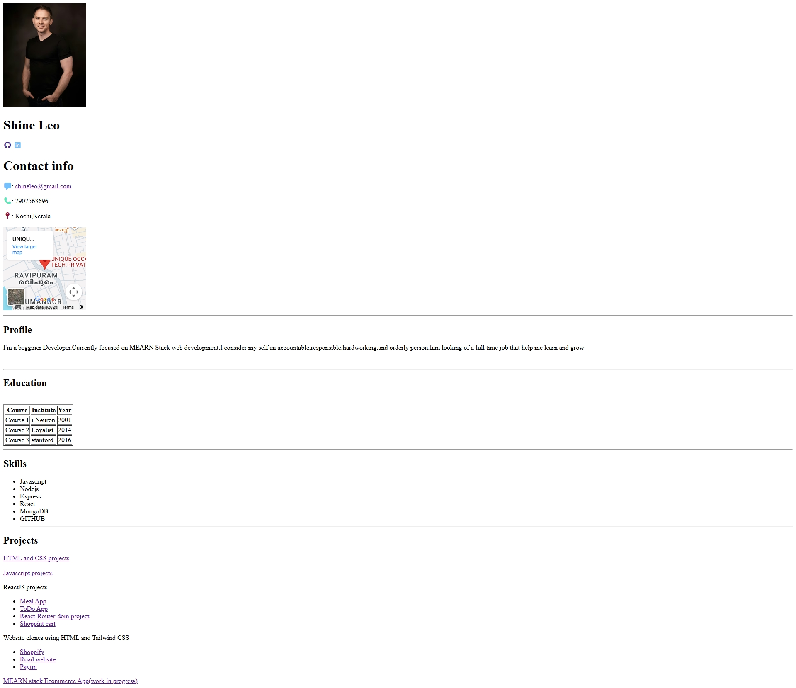

Here is a clean, polished **README.md** for your HTML profile/resume webpage.
You can copy-paste it directly into a `README.md` file.

---

# 📄 Personal Portfolio – HTML Profile Page

This project is a simple, responsive **HTML Portfolio/Profile Page** showcasing personal details, skills, education, projects, and contact information. It includes social media links, an embedded Google Map, and icons from Font Awesome.

---




## 🚀 Features

* **Personal Profile Section** with photo, name, and social icons
* **Contact Information** including email, phone, and location
* **Embedded Google Maps** location preview
* **Education Table** listing major courses
* **Skills Section** with technology stack
* **Projects Section** linking to web and ReactJS projects
* Clean structure and easy to customize

---

## 🛠️ Technologies Used

| Technology            | Purpose                                     |
| --------------------- | ------------------------------------------- |
| **HTML5**             | Core structure of the webpage               |
| **Font Awesome**      | Displaying icons for social media & contact |
| **Google Maps Embed** | Showing location in iframe                  |
| **Unsplash Image**    | Profile picture                             |

---

## 📂 Project Structure

```
project/
│
├── index.html
└── README.md
```

---

## 📸 Preview (HTML Outline)

The page contains the following sections:

* **Profile Image and Name**
* **Social Media Links (GitHub, LinkedIn)**
* **Contact Details**
* **Google Maps Embed**
* **Profile / Summary**
* **Education Table**
* **Skills List**
* **Projects List**

---

## 🔗 External Resources Used

* **Font Awesome Icons**
  Included via CDN:

  ```html
  <link rel="stylesheet" href="https://cdnjs.cloudflare.com/ajax/libs/font-awesome/7.0.1/css/all.min.css">
  ```

* **Unsplash for Profile Image**

* **Google Maps Embed** for location display

---

## 📥 How to Use

1. Copy the `index.html` file into your project folder.
2. Open it in any browser (Chrome, Firefox, Edge, etc.).
3. Replace:

   * Profile photo URL
   * Name and Contact details
   * Social links
   * Education information
   * Project links
4. Save changes and refresh the browser.

---

## ✨ Customization Suggestions

* Add your own **CSS file** to improve styling
* Make the layout responsive using **Flexbox or Grid**
* Add animations using **CSS transitions**
* Convert the project into a full portfolio website

---

## 💬 Author

**Shine Leo**
Beginner MEARN Developer
Focused on improving skills and building full-stack projects

GitHub: [https://github.com/sarathp678](https://github.com/sarathp678)

---

If you'd like, I can also:

✅ Convert this HTML into a responsive CSS-styled portfolio
✅ Build a dark/light theme
✅ Create a React version of your portfolio

Just tell me!
